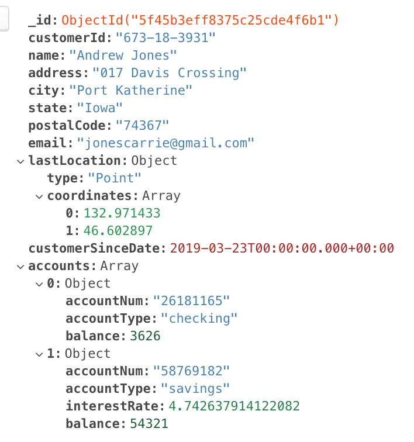

# MongoDB - Financials Workshop

The purpose of this workshop is to provide a series of query examples to assist a MongoDB user in how
to utilize a variety of elements of the MongoDB Query Language (MQL) and the MongoDB Aggregation Framework.

## Installation Prerequisites
* MongoDB 4.4

* MongoDB Shell and/or MongoDB Compass to perform the query exercises

## Workshop Outline
1. Generate Financial data
2. Query Examples
3. Aggregation Framework
4. Text Search
5. Change Stream Example

## Generate Financial Data
To generate financial data, use the following [Python Data Generator](https://github.com/blainemincey/generate_sample_data).
After installing the required Python modules, modify the appropriate values in the env.example file and then
rename the file to .env.  Run the script ``generate_financial_data.py``.  A sample JSON document is indicated below.


#### Note: Based on the dynamic data that is generated, the filters in the examples may have to be modified accordingly.

## Query Examples
* Basic filter
    * Customers in Texas:
    
        ```
        db.customerAccounts.find({"state":"Texas"}
        ```
      
    * Customers in Texas with Projection:
    
        ```
        db.customerAccounts.find({"state":"Texas"}, 
                {_id: 0, customerId: 1, customerSinceDate: 1})
        ```
      
    * Customers in Texas with Projection sorted by customerSinceDate in descending order:
    
        ```
        db.customerAccounts.find({"state":"Texas"}, 
            {_id: 0, customerId: 1, customerSinceDate: 1}).sort({customerSinceDate: -1})
        ```
    
    * Customers in Texas OR Delaware:
    
        ```
        db.customerAccounts.find({state:{$in:['Texas', 'Delaware']}}, 
            {_id:0, customerId: 1, state: 1} )
        ```
    
    * Customers in Texas OR Delaware and are new customers this year:
    
        ```
        db.customerAccounts.find({state:{$in:['Texas', 'Delaware']}, 
            customerSinceDate: {$gte:ISODate('2020-01-01')}}, 
            {_id: 0, state: 1, customerSinceDate: 1})
        ```  
    
* Filter on embedded object/array
    * Customers with a ONLY a Savings Account:
        ```
        db.customerAccounts.find({ accounts:{$size:1}, "accounts.accountType":"savings" }, 
            {_id:0, name:1, "accounts.accountType":1, "accounts.balance":1})
        ```
    
    * Customers with ONLY a Savings Account and a balance > $25000:
        ```
        db.customerAccounts.find({ accounts:{$size:1}, "accounts.accountType":"savings", "accounts.balance":{$gt:25000} }, 
            {_id:0, name:1, "accounts.accountType":1, "accounts.balance":1})
        ```
    
    * Customers with a Checking Account with a negative balance:
        ```
        db.customerAccounts.find({ "accounts.accountType":"checking", "accounts.balance":{$lt:0} }, 
            {_id:0, name:1, "accounts.accountType":1, "accounts.balance":1})
        ```
    
    * Customers with both a Savings and Checking account:
        ```
        db.customerAccounts.find({ "accounts.accountType":{$all:["savings","checking"]}}, 
            {_id:0, name:1, "accounts.accountType":1, "accounts.balance":1})
        ```
    
    
* Filter based on regular expression
    * Customer with name starting with 'Andrew'
        ```
        db.customerAccounts.find({name: /^Andrew/}, {_id:0, name: 1})
        ```
    
    * Customers with a '@gmail.com' email address and a customer for more than 5 years:
        ```
        db.customerAccounts.find({email:/gmail.com$/, customerSinceDate:{$lte:ISODate('2015-08-27')}}, 
            {_id:0,email:1, customerSinceDate:1})
        ```


* Existence check/Equality filter
    * Number of customers without a Savings account:
        ```
      db.customerAccounts.find({accounts:{$size:1}, 
            "accounts.accountType":"checking"}).size()
        ```
    
    * Number of customers from a previous bank:
        ```
        db.customerAccounts.find({previousBank:{$exists:true}}).size()
        ```
      
    * Customers with a name NOT starting with Andrew
        ```
        db.customerAccounts.find( { name: { $not: { $regex: "^Andrew" } } } , {_id:0, name:1})
        ```
    
* Explain Plan/Indexes
    * Customers with a Savings Account Interest Rate > 3%
        ```
        db.customerAccounts.find({ "accounts.accountType":"savings", "accounts.interestRate":{$gt:3}}, {_id:0, name:1, "accounts.interestRate":1})
        ```
      
    * Use an Explain Plan to look at performance:
        ```
        db.customerAccounts.find({ "accounts.accountType":"savings", "accounts.interestRate":{$gt:3}}).explain()
        ```
      
    * The explain plan should indicate a *COLLSCAN* or collection scan.  We will now
      create an index:
        ```
        db.customerAccounts.createIndex({"accounts.interestRate": 1})
        ```
      
    * List the current indexes to make sure index was created:
        ```
        db.customerAccounts.getIndexes()
        ```
      
    * Now with the created index, re-run the explain plan in the earlier step. You should
      see an entry in the output indicating both a *FETCH* and *IXSCAN*.

## Aggregation Framework
* Basic aggregation
    * What is the most popular month for new customers to join:
        ```
        db.customerAccounts.aggregate([
            {$project: {monthJoined: {$month:"$customerSinceDate"} }}, 
            {$group: { _id : {monthJoined:"$monthJoined"} ,
            number : { $sum : 1 }}}, 
            {$sort: {   number: -1 }}, {$limit: 1}])
        ```

    * What month is the most popular for new customers to join in the state of GA:
        ```
        db.customerAccounts.aggregate([
                    {$match: {   state:"Georgia" }}, 
                    {$project: {   monthJoined: {$month:"$customerSinceDate"} }}, 
                    {$group: {   
                        _id : {     monthJoined:"$monthJoined"} ,      
                                    number : { $sum : 1 }     }  }, 
                    {$sort: {   "number": -1 }}, {$limit: 1}])
        ```
* Complex aggregation
    * Which state has the largest savings account balance:
        ```
        db.customerAccounts.aggregate([
            {$unwind: {   path: "$accounts" }}, 
            {$match: {   "accounts.accountType":"savings" }}, 
            {$group: {   _id: {state:"$state"},   totalBalance: {     $sum: "$accounts.balance"   } }}, {$sort: {   totalBalance: -1 }}])
        ```
         *Try to find the avg balance   
         
    * Which state has the highest average interest rate for savings accounts:
        ```
        db.customerAccounts.aggregate([
            {$unwind: {   path: "$accounts" }}, 
            {$match: {   "accounts.accountType":"savings" }}, 
            {$group: {   _id: {state:"$state"},   
                avgIntRate: {     $avg: "$accounts.interestRate"   } }}, 
            {$sort: {   avgIntRate: -1 }}])
        ```
    * What is the name of the customer with the largest negative checking account balance:
        ```
        db.customerAccounts.aggregate([
                {$unwind: {   path: "$accounts" }}, 
                {$match: {   "accounts.accountType":"checking",   "accounts.balance": {$lt:0} }}, 
                {$sort: {   "accounts.balance": 1 }}, 
                {$project: {   _id:0,   name:1,   state:1,   "accounts.balance":1 }}, 
                {$limit: 1}])
        ```
      
* Statistical/Mathematical aggregation

## Text Search
* Text Search example

## Change Stream Example
** time permitting - change streams/change data capture


